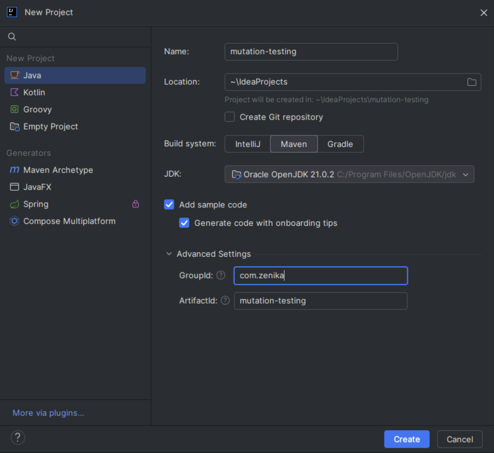

# Lab 1 : Mettre en place le mutation testing
Duration: 00:10:00

## Objectifs
Créer un projet Maven simple et mettre en place le mutation testing avec PIT.

## Étapes
1. Créer un projet Maven simple
2. Ajouter une classe à tester
3. Ajouter une classe de test
4. Lancer les tests et récupérer le rapport de couverture
5. Ajouter PIT à votre projet
6. Exécuter PIT
7. Analyser les résultats

### 1. Créer un projet Maven simple

Ouvrez Intellij et créez un nouveau projet Java en utilisant Maven : 



- File > New > Project...
- Sélectionnez Maven dans la liste des projets
- Utiliser le JDK 21 (installé sur la machine dans C:\Program Files\OpenJSK\jdk-21)
- Nommez votre projet `mutation-testing`
- Cliquez sur Create

ou créez le projet à la main :

```shell
mvn archetype:generate -DgroupId=com.zenika -DartifactId=mutation-testing -DarchetypeArtifactId=maven-archetype-quickstart -DinteractiveMode=false
```

### 2. Ajouter une classe à tester

Ajoutez une classe à tester dans le répertoire `src/main/java/com/zenika/AgeUtils.java` :

```java
package com.zenika;

public class AgeUtils {
    AgeUtils() {}

    static boolean isAdulte(int age) {
        return age >= 18;
    }
}
```

### 3. Ajouter une classe de test

Ajoutez une classe de test dans le répertoire `src/test/java/com/zenika/AgeUtilsTest.java` :

```java
package com.zenika;

import org.junit.jupiter.api.Test;

import static org.junit.jupiter.api.Assertions.*;

class AgeUtilsTest {

    @Test
    void isAdulte_should_return_true_when_age_is_over_18() {
        // Given
        int age = 20;

        // When
        boolean result = AgeUtils.isAdulte(age);

        // Then
        assertTrue(result);
    }

    @Test
    void isAdulte_should_return_false_when_age_is_under_18() {
        // Given
        int age = 17;

        // When
        boolean result = AgeUtils.isAdulte(age);

        // Then
        assertFalse(result);
    }

    @Test
    void AgeUtils_constructor_coverage() {
        assertNotNull(new AgeUtils());
    }
}
```

### 4. Lancer les tests et récupérer le rapport de couverture

Ajouter les dépendances JUnit 5 et le plugin `jacoco-maven-plugin` dans le `pom.xml` :

```xml
<project>
    <!-- ... -->
    <dependencies>
        <!-- JUnit 5 -->
        <dependency>
            <groupId>org.junit.jupiter</groupId>
            <artifactId>junit-jupiter</artifactId>
            <version>5.11.4</version>
            <scope>test</scope>
        </dependency>
        <dependency>
            <groupId>org.assertj</groupId>
            <artifactId>assertj-core</artifactId>
            <version>3.25.3</version>
            <scope>test</scope>
        </dependency>
    </dependencies>
    <build>
        <plugins>
            <plugin>
                <groupId>org.jacoco</groupId>
                <artifactId>jacoco-maven-plugin</artifactId>
                <version>0.8.12</version>
                <executions>
                    <execution>
                        <goals>
                            <goal>prepare-agent</goal>
                            <goal>report</goal>
                        </goals>
                    </execution>
                </executions>
            </plugin>
        </plugins>
    </build>
</project>
```

Lancez les tests avec la commande suivante :

```shell
mvn test
```

Récupérez le rapport de couverture dans le répertoire `target/site/jacoco/index.html`.
Notre classe devrait être couverte à 100%.

### 5. Ajouter PIT à votre projet

Maintenant ajoutons PIT à notre projet. Cela nous permettra de lancer le mutation testing sur nos tests.

Ajoutez la dépendance PIT dans le `pom.xml` :

```xml
<project>
    <!-- ... -->
    <build>
        <!-- ... -->
        <plugins>
            <!-- ... -->
            <plugin>
                <groupId>org.pitest</groupId>
                <artifactId>pitest-maven</artifactId>
                <version>1.16.1</version>
                <executions>
                    <execution>
                        <id>pit-report</id>
                        <phase>test</phase>
                        <goals>
                            <goal>mutationCoverage</goal>
                        </goals>
                    </execution>
                </executions>
                <dependencies>
                    <dependency>
                        <groupId>org.pitest</groupId>
                        <artifactId>pitest-junit5-plugin</artifactId>
                        <version>1.2.1</version>
                    </dependency>
                </dependencies>
            </plugin>
        </plugins>
    </build>
</project>
```

### 6. Exécuter PIT

Lancez PIT avec avec maven test dans intellij ou avec la commande suivante :

```shell
mvn test
```

### 7. Analyser les résultats

Ouvrez le rapport de mutation testing dans le répertoire `target/pit-reports/index.html`.

On voit que l'on est pas à 100% de mutation coverage. Cela signifie que notre classe de test n'est pas assez robuste.

En particulier, la mutation `age >= 18` qui est remplacée par `age > 18` n'est pas détectée par nos tests.

Nous pouvons remarqué que nous n'avons pas de tests pour le cas où `age == 18`.

Ajoutez un test pour ce cas et relancez PIT pour vérifier que la mutation est bien détectée.

```java

   @Test
    void isAdulte_should_return_true_if_age_is_18() {
        // Given
        int age = 18;

        // When
        boolean result = AgeUtils.isAdulte(age);

        // Then
        assertTrue(result);
    }
```