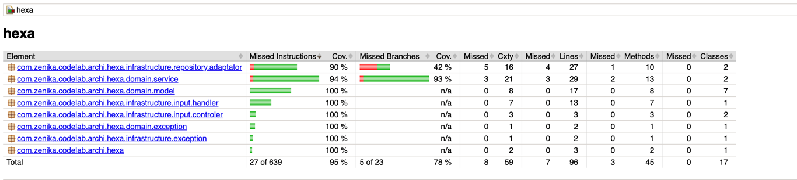
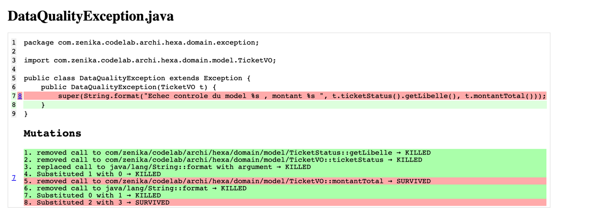
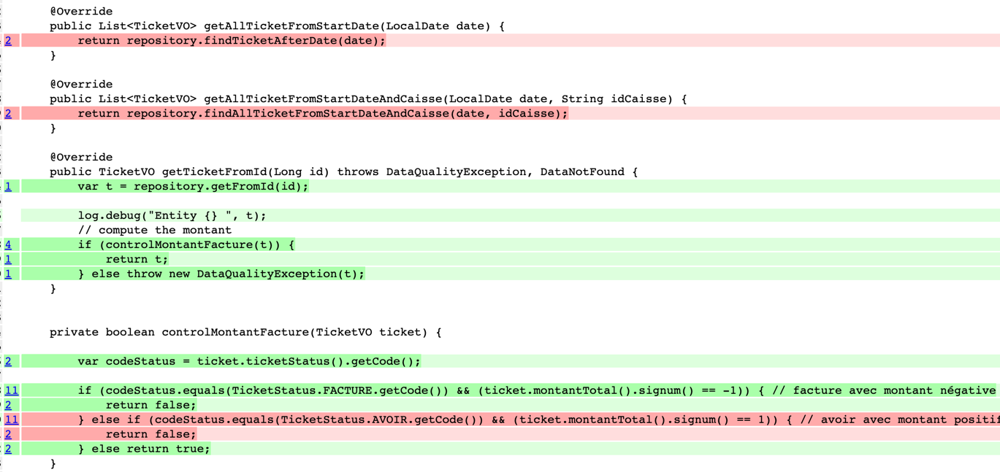
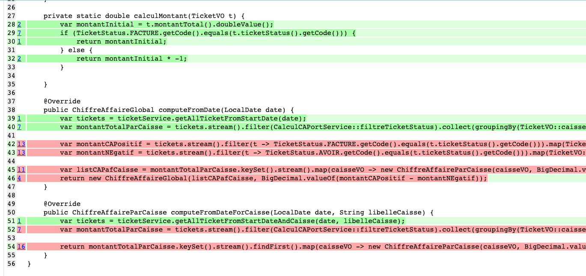
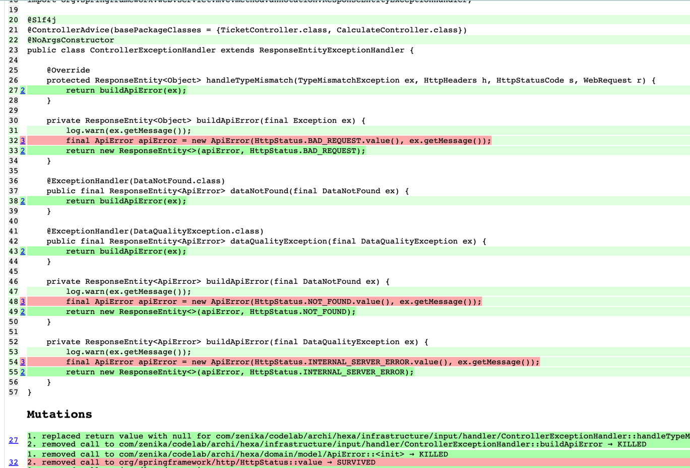
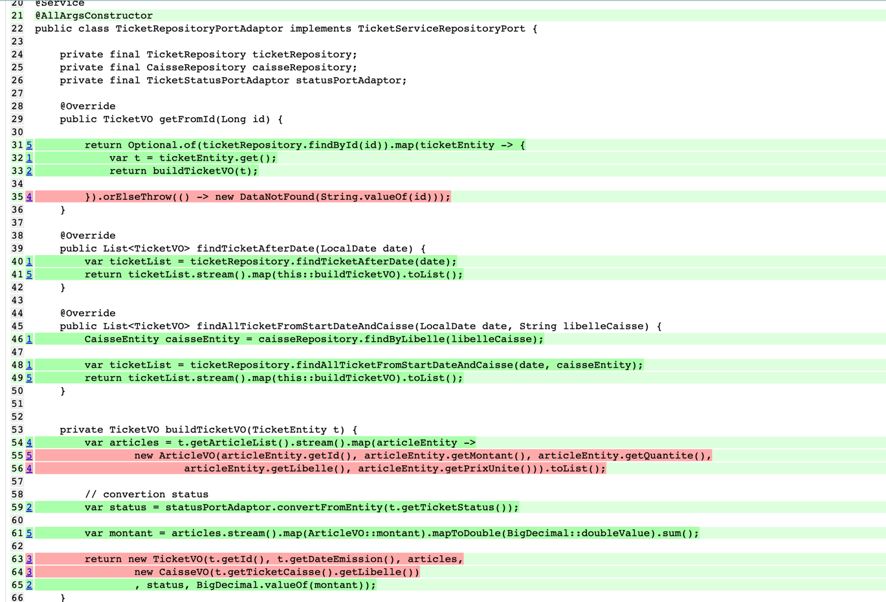

# Lab 4 : Spring
Duration: 00:45:00

## Objectifs
Utiliser un projet réel avec Spring et des tests

## 1.1 Récupération du projet

- git clone https://github.com/Zenika-Training/codelab-mutation-testing.git
- Importez le projet se trouvant dans le répertoire challenges/application-hexa dans votre IDE préféré
  IntelliJ / VSCode / Eclipse...
- Configurez le projet pour utiliser JDK 21
- Construisez le projet avec `mvn clean install`

**Si vous rencontrez des erreurs, demandez immédiatement de l'aide à votre formateur !**

## 1.2 Exploration du projet

Parcourez le projet pour comprendre son organisation.

<div class="pb"></div>

Dans le répertoire target/site ouvrez le rapport de test de Jaccoco 

## 1.3 Ajouter la dépendance PIT

Ajoutez la dépendance PIT dans le `pom.xml` du projet 'application-hexa:

```xml

<project>
  <!-- ... -->
  <build>
    <!-- ... -->
    <plugins>
      <!-- ... -->
      <plugin>
        <groupId>org.pitest</groupId>
        <artifactId>pitest-maven</artifactId>
        <version>1.16.1</version>
        <dependencies>
          <dependency>
            <groupId>org.pitest</groupId>
            <artifactId>pitest-junit5-plugin</artifactId>
            <version>1.2.1</version>
          </dependency>
        </dependencies>
      </plugin>
    </plugins>
  </build>
</project>
```

### Exécuter PIT

Lancez PIT avec la commande suivante :

```shell
mvn pitest:mutationCoverage
```

## 1.4 Analyser les résultats

Le résultat doit lancer des mutations pour vérifier la fiabilité de nos tests

```shell
================================================================================
- Statistics
================================================================================
>> Line Coverage (for mutated classes only): 79/86 (92%)
>> Generated 254 mutations Killed 212 (83%)
>> Mutations with no coverage 9. Test strength 87%
>> Ran 305 tests (1.2 tests per mutation)
Enhanced functionality available at https://www.arcmutate.com/


```


Le package *adaptator*, *service*, exception, *handler* ne semble pas avoir une couverture suffisamment forte pour PI.
Ces packages sont importants car elles portent soit la logique métier du domaine, soit la logique de transformation
d'une entité fournit par un provider et objet métier, et soit le message que l'on peut retourner à l'utilisateur.

## 1.4.1 Analysons la partie exception

Ces classes d'Exception portent des messages qui seront affichés à l'utilisateur final.
De plus en fonction de l'erreur, cela devra déclencher un handler qui fabriquera une réponse Http custom.

Pour faciliter l'analyse de l'erreur, il est donc nécessaire de s'assurer que toutes les informations sont présentes.



Les mutations qui continuent à exister sont des mutations sont des mutations de substitutions et des mutations d'appel
de méthodes

## 1.4.2 Analysons la partie service

Il y a deux services:

* TicketService.java (3 mutations)
* CalculCAPortService.java (1 mutation)

Les deux classes sont importantes, car elles portent de la logique métier:

* filtrage
* règle de calcul

Par exemple, pour calculer le chiffre d'affaire nous devons filtrer la source de sorte à garder que les données
éligibles.

```java
  private static boolean filtreTicketStatus(TicketVO ticketVO){
        var status=ticketVO.ticketStatus();

        return TicketStatus.FACTURE.getCode().equals(status.getCode())
        ||TicketStatus.AVOIR.getCode().equals(status.getCode());
        }
```

### 1.4.2.1 TicketService



Deux choses doivent nous alerter, les mutations continuent à exister car :

* deux méthodes ne sont pas testés
* un test une partie n'est pas couverte.


La méthode signum de BigDecimal retourne 3 possibilités soit -1, 0, ou 1.
Dans les tests présents on test que -1 ou 1, **il nous manque donc 1 cas**.

De plus pour exécuter ce contrôl, nous avons besoin d'avoir accès à un attribut d'un objet il nous manque un control à
ce niveau.

### 1.4.2.2 CalculCAPortService



La partie qui pose problème est assez intéressante car il s'agit d'un moteur de calcul.
De plus le résultat est exposé directement à l'utilisateur final.

La ligne qui pose problème a pour objectif de construire une liste de tuple et chaque tuple est objet qui nous donne le
CA par caisse.

Deux problèmes existent:

* à partir d'une lambda on construit une map à partir d'une liste. L'input de la map ets le problème
* dans la méthode compute, la méthode filter semble poser un problème et la sortie de la méthode n'est pas aussi testée

Aller dans le test 'CalculCAPortServiceTest' pour corriger les problèmes

## 1.5 Analysons la partie handler d'exception sur la partie Rest

La classe ControllerExceptionHandler gère les exceptions et les messages customs qui vont être retournées à
l'utilisateur

Ce que l'on voit dans le rapport Pit dans le body du message http qui n'est pas testé en particulier le code http.



## 1.6 Analysons la partie adaptor

La classe adaptor est une classe qui va transformer la donnée fournit par notre provider (ici une BDD) en une objet du
domaine
métier.



En général, ce qui manque se sont des tests de contrôle sur la sortie.


