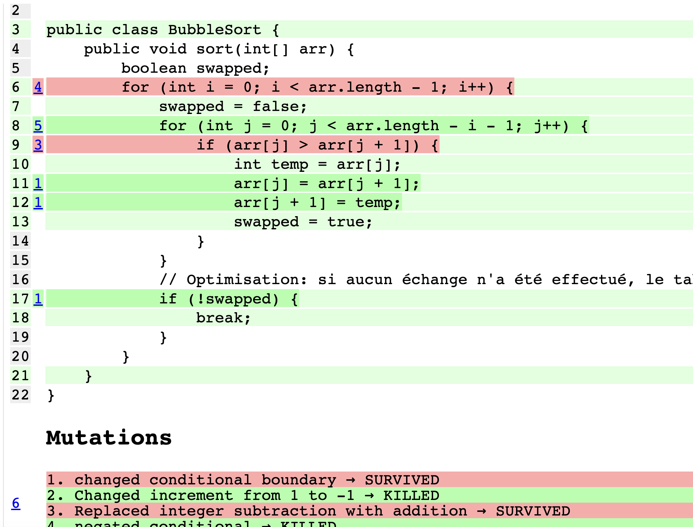

# Lab 5 : Bonus trie à bulles
Duration: 00:30:00

## Objectifs
Un petit code bonus pour se confronter au limite du mutation testing.

## Étapes
1. Ajouter une classe `BubbleSort` avec
2. Ajouter des tests unitaires
3. Comprendre les erreurs de mutation
4. Impossible de trouver des tests pour passer le mutation testing

### 1. Ajouter une classe `BubbleSort`
Créez une classe `BubbleSort` dans le répertoire `src/main/java/com/zenika/BubbleSort.java` :

```java
package com.zenika;

public class BubbleSort {
    public void sort(int[] arr) {
        boolean swapped;
        for (int i = 0; i < arr.length - 1; i++) {
            swapped = false;
            for (int j = 0; j < arr.length - i - 1; j++) {
                if (arr[j] > arr[j + 1]) {
                    int temp = arr[j];
                    arr[j] = arr[j + 1];
                    arr[j + 1] = temp;
                    swapped = true;
                }
            }
            // Optimisation: si aucun échange n'a été effectué, le tableau est déjà trié
            if (!swapped) {
                break;
            }
        }
    }
}
```

### 2. Ajouter des tests unitaires

Ajoutez une classe de test dans le répertoire `src/test/java/com/zenika/BubbleSortTest.java` :

```java
package com.zenika;

import org.junit.jupiter.api.Test;

import static org.junit.jupiter.api.Assertions.assertArrayEquals;

public class BubbleSortTest {
    BubbleSort bubbleSort = new BubbleSort();

    @Test
    public void testEmptyArray() {
        int[] arr = {};
        bubbleSort.sort(arr);
        assertArrayEquals(new int[] {}, arr);
    }

    @Test
    public void testAlreadySortedArray() {
        int[] arr = {1, 2, 3, 4, 5};
        bubbleSort.sort(arr);
        assertArrayEquals(new int[] {1, 2, 3, 4, 5}, arr);
    }

    @Test
    public void testSortedArray() {
        int[] arr = {5, 5, 5, 5, 1};
        bubbleSort.sort(arr);
        assertArrayEquals(new int[] {1, 5, 5, 5, 5}, arr);
    }

    @Test
    public void testReverseSortedArray() {
        int[] arr = {5, 4, 3, 2, 1};
        bubbleSort.sort(arr);
        assertArrayEquals(new int[] {1, 2, 3, 4, 5}, arr);
    }

    @Test
    public void testRandomArray() {
        int[] arr = {3, 1, 4, 1, 5, 9, 2, 6, 5, 3};
        bubbleSort.sort(arr);
        assertArrayEquals(new int[] {1, 1, 2, 3, 3, 4, 5, 5, 6, 9}, arr);
    }

    @Test
    public void testSameSortedArray() {
        int[] arr = {2, 1, 1};
        bubbleSort.sort(arr);
        assertArrayEquals(new int[] {1, 1, 2}, arr);
    }
}
```

### 3. Lancer les tests et récupérer le rapport de couverture

Lancez PIT avec avec maven test dans intellij ou avec la commande suivante :

```shell
mvn test
```

### 4. Impossible de trouver des tests pour passer le mutation testing

On remarque dans le résultat que deux lignes résistent à la mutation testing :



La première boucle for exécute X fois la deuxième boucle, or les mutations faites sur cette boucle (par exemple enlever le -1 ou remplacer le + par le moins) ne sont pas détectées par les tests unitaires car dans tous les cas la boucle s'arrête quand tous les éléments sont triés.

La ligne `if (arr[j] > arr[j + 1])` quand elle va être mutée avec un `>=` cela fera simplement des permutations inutile mais sans changer le résultat final.

Pour pouvoir tuer les mutants, il est nécessaire de modifier notre code pour retourner le nombre de fois que l'algorithme a trié le tableau (le nombre de fois que la première boucle a été exécutée).

On peut alors dans nos tests ajouter des conditions sur le nombre de fois que l'on exécute la boucle et ainsi supprimer.
